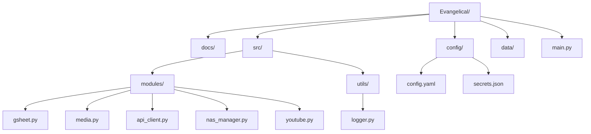

# 📂 Project Folder Structure & File Roles
# 프로젝트 폴더 구조 및 파일 역할 정의

The following structure is designed for modularity and scalability.
모듈화와 확장성을 고려하여 설계된 폴더 구조입니다.

---

## 1. Root Directory (루트 디렉토리)

*   **`main.py`**:
    *   **Role**: Entry point of the application. Orchestrates the entire workflow.
    *   **역할**: 프로그램의 시작점. 전체 워크플로우를 지휘합니다.
*   **`requirements.txt`**:
    *   **Role**: List of Python dependencies (e.g., `gspread`, `ffmpeg-python`).
    *   **역할**: 필요한 파이썬 라이브러리 목록.

## 2. `config/` (Settings)

*   **`config.yaml`**:
    *   **Role**: Global settings. Contains paths (Dev/Prod), YouTube constraints, and Prompt templates.
    *   **역할**: 전체 설정. 경로 설정(개발/운영), 유튜브 제약사항, 프롬프트 템플릿 등을 담습니다.
*   **`secrets.json`** (Ignored by Git):
    *   **Role**: Stores API Keys (Google Cloud, Telegram Token).
    *   **역할**: API 키 등 보안 정보를 저장. (깃허브 업로드 제외)

## 3. `src/modules/` (Core Logic)

*   **`gsheet.py`**:
    *   **Role**: Handles Google Sheet connection, reading pending rows, and updating status.
    *   **역할**: 구글 시트 연결, 대기 항목 읽기, 상태 업데이트 담당.
*   **`media.py`**:
    *   **Role**: Wraps `ffmpeg` commands. Handles Audio Extraction and Thumbnail Cropping.
    *   **역할**: `ffmpeg` 명령어 래퍼. 오디오 추출 및 썸네일 크롭 담당.
*   **`api_client.py`**:
    *   **Role**: Communicates with the GPU Server. Sends audio file, receives text summary.
    *   **역할**: GPU 서버와 통신. 오디오 전송 및 요약문 수신.
*   **`nas_manager.py`**:
    *   **Role**: Handles File Operations (Rename, Move). Switches behavior based on Dev/Prod mode.
    *   **역할**: 파일 이동/이름변경 담당. 개발/운영 모드에 따라 경로를 스위칭.
*   **`youtube.py`**:
    *   **Role**: Handles YouTube Upload API and quota management.
    *   **역할**: 유튜브 업로드 및 할당량 관리.

## 4. `data/` (Local Storage)

*   **`Mission_Inbox`** (Git Ignore):
    *   **Role**: Default input folder for user downloaded videos.
    *   **역할**: 사용자가 다운로드한 영상이 위치하는 기본 입력 폴더.
*   **`temp/`**:
    *   **Role**: Temporary storage for extracted mp3s or cropped jpgs before cleanup.
    *   **역할**: mp3 추출물이나 썸네일 저장용 임시 폴더.
